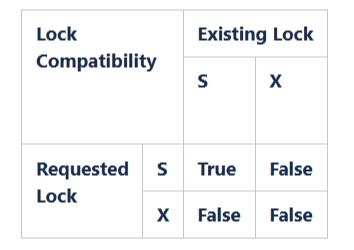
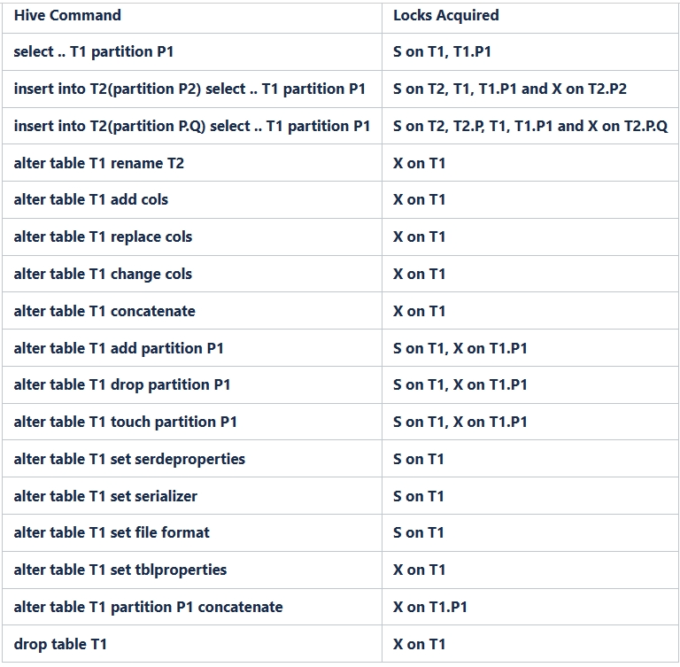

# Locking

[TOC]

## Hive Concurrency Model
### Use Cases

Concurrency support (http://issues.apache.org/jira/browse/HIVE-1293) is a must in databases and their use cases are well understood. At a minimum, we want to support concurrent readers and writers whenever possible. It would be useful to add a mechanism to discover the current locks which have been acquired. There is no immediate requirement to add an API to explicitly acquire any locks, so all locks would be acquired implicitly.

所有的锁都会是隐式获取。

The following lock modes will be defined in hive (Note that Intent lock is not needed).

- Shared (S)
- Exclusive (X)

As the name suggests, multiple shared locks can be acquired at the same time, whereas X lock blocks all other locks.

可以同时获取多种共享锁，排他锁会阻塞所有其他锁。

The compatibility matrix is as follows:

For some operations, locks are hierarchical in nature -- for example for some partition operations, the table is also locked (to make sure that the table cannot be dropped while a new partition is being created).

The rational behind the lock mode to acquire is as follows:

For a non-partitioned table, the lock modes are pretty intuitive. When the table is being read, a S lock is acquired, whereas an X lock is acquired for all other operations (insert into the table, alter table of any kind etc.)

对于非分区表，当读取表时，获取 S 锁，当执行所有其他操作（插入或改变）时，就会获取 X 锁。

For a partitioned table, the idea is as follows:

A 'S' lock on table and relevant partition is acquired when a read is being performed. For all other operations, an 'X' lock is taken on the partition. However, if the change is only applicable to the newer partitions, a 'S' lock is acquired on the table, whereas if the change is applicable to all partitions, a 'X' lock is acquired on the table. Thus, older partitions can be read and written into, while the newer partitions are being converted to RCFile. Whenever a partition is being locked in any mode, all its parents are locked in 'S' mode.

对于分区表，当执行读取操作时，获取表和相关分区的 S 锁。对于所有其他操作，就会获取此分区的 X 锁。

如果更改仅适用于较新的分区，就获取表的 S 锁【如，alter table T1 add partition P1 \ S on T1, X on T1.P1】，如果应用到所有分区，那么就获取表的 X 锁 【alter table T1 set tblproperties \ X on T1】。

因此，旧分区可以读取和写入，而新分区正在转换为 RCFile。

无论何时，一个分区在任意模式下被锁，它的所有父都以 S 模式被锁。

Based on this, the lock acquired for an operation is as follows:

In order to avoid deadlocks, a very simple scheme is proposed here. All the objects to be locked are sorted lexicographically, and the required mode lock is acquired. Note that in some cases, the list of objects may not be known -- for example in case of dynamic partitions, the list of partitions being modified is not known at compile time -- so, the list is generated conservatively. Since the number of partitions may not be known, an exclusive lock is supposed to be taken (but currently not due to [HIVE-3509](https://issues.apache.org/jira/browse/HIVE-3509) bug) on the table, or the prefix that is known.

Two new configurable parameters will be added to decide the number of retries for the lock and the wait time between each retry. If the number of retries are really high, it can lead to a live lock. Look at ZooKeeper recipes (http://hadoop.apache.org/zookeeper/docs/r3.1.2/recipes.html#sc_recipes_Locks) to see how read/write locks can be implemented using the zookeeper apis. Note that instead of waiting, the lock request will be denied. The existing locks will be released, and all of them will be retried after the retry interval.

The recipe listed above will not work as specified, because of the hierarchical nature of locks.

The 'S' lock for table T is specified as follows:

- Call create( ) to create a node with pathname "/warehouse/T/read-". This is the lock node used later in the protocol. Make sure to set the sequence and ephemeral flag.

- Call getChildren( ) on the lock node without setting the watch flag.

- If there is a child with a pathname starting with "write-" and a lower sequence number than the one obtained, the lock cannot be acquired. Delete the node created in the first step and return.

- Otherwise the lock is granted.

The 'X' lock for table T is specified as follows:

- Call create( ) to create a node with pathname "/warehouse/T/write-". This is the lock node used later in the protocol. Make sure to set the sequence and ephemeral flag.

- Call getChildren( ) on the lock node without setting the watch flag.

- If there is a child with a pathname starting with "read-" or "write-" and a lower sequence number than the one obtained, the lock cannot be acquired. Delete the node created in the first step and return.

- Otherwise the lock is granted.

The proposed scheme starves the writers for readers. In case of long readers, it may lead to starvation for writers.

The default Hive behavior will not be changed, and concurrency will not be supported.

### Turn Off Concurrency

You can turn off concurrency by setting the following variable to false: [hive.support.concurrency](https://cwiki.apache.org/confluence/display/Hive/Configuration+Properties#ConfigurationProperties-hive.support.concurrency).

### Debugging

You can see the locks on a table by issuing the following command:

- SHOW LOCKS <TABLE_NAME>;
- SHOW LOCKS <TABLE_NAME> EXTENDED;
- SHOW LOCKS <TABLE_NAME> PARTITION (<PARTITION_DESC>);
- SHOW LOCKS <TABLE_NAME> PARTITION (<PARTITION_DESC>) EXTENDED;

See also [EXPLAIN LOCKS](https://cwiki.apache.org/confluence/display/Hive/LanguageManual+Explain#LanguageManualExplain-TheLOCKSClause).

### Configuration

Configuration properties for Hive locking are described in [Locking](https://cwiki.apache.org/confluence/display/Hive/Configuration+Properties#ConfigurationProperties-Locking).

## Locking in Hive Transactions

Hive [0.13.0](https://issues.apache.org/jira/browse/HIVE-5317) adds transactions with row-level ACID semantics, using a new lock manager. For more information, see:

- [ACID and Transactions in Hive](https://cwiki.apache.org/confluence/display/Hive/Hive+Transactions)
- [Lock Manager](https://cwiki.apache.org/confluence/display/Hive/Hive+Transactions#HiveTransactions-LockManager)
