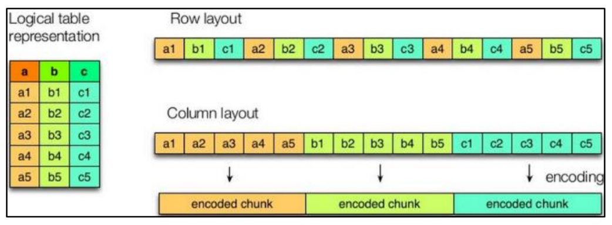
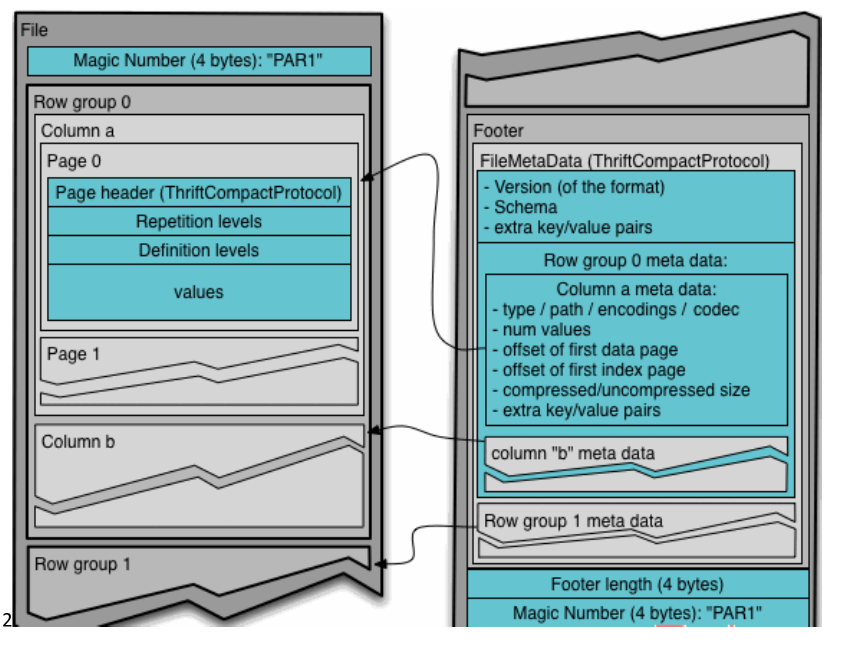

# hive 中使用不同的文件存储格式

[TOC]

## 1 列式存储和行式存储



如图所示左边为逻辑表，右边第一个为行式存储，第二个为列式存储。

1 ） 行存储的特点

查询满足条件的一整行数据的时候，列存储则需要去每个聚集的字段找到对应的每个列的值，行存储只需要找到其中一个值，其余的值都在相邻地方，所以此时行存储查询的速度更快。

（一行行的存储表数据）

2 ） 列存储的特点

因为每个字段的数据聚集存储，在查询只需要少数几个字段的时候，能大大减少读取的数据量；每个字段的数据类型一定是相同的，列式存储可以针对性的设计更好的设计压缩算法。

（一列类的存储表数据）

- TEXTFILE 和 SEQUENCEFILE 的存储格式都是基于行存储的
- ORC 和 PARQUET 是基于列式存储的

## 2  TextFile 格式

默认格式，数据不做压缩，磁盘开销大，数据解析开销大。

可结合 Gzip、Bzip2 使用，但使用 Gzip 这种方式，hive 不会对数据进行切分，从而无法对数据进行并行操作。

## 3 Orc 格式

Orc (Optimized Row Columnar)是 Hive 0.11 版里引入的新的存储格式。

如图所示可以看到每个 Orc 文件由 1 个或多个 stripe 组成，每个 stripe 一般为 HDFS
的块大小，每一个 stripe 包含多条记录，这些记录按照列进行独立存储，对应到 Parquet
中的 row group 的概念。

每个 Stripe 里有三部分组成，分别是 Index Data，Row Data，Stripe Footer


1）Index Data

一个轻量级的 index，默认是每隔 1W 行做一个索引。

这里做的索引应该只是记录某行的各字段在 Row Data 中的 offset。

2）Row Data

存的是具体的数据，先取部分行，然后对这些行按列进行存储。

对每个列进行了编码，分成多个 Stream 来存储。

3）Stripe Footer

存的是各个 Stream 的类型，长度等信息。

每个文件有一个 File Footer，这里面存的是每个 Stripe 的行数，每个 Column 的数据类
型信息等；

每个文件的尾部是一个 PostScript，这里面记录了整个文件的压缩类型以及
FileFooter 的长度信息等。

在读取文件时，会 seek 到文件尾部读 PostScript，从里面解析到 File Footer 长度，再读 FileFooter，从里面解析到各个 Stripe 信息，再读各个 Stripe，即从后往前读。

[点这里](https://github.com/ZGG2016/hive-website/blob/master/User%20Documentation/Hive%20SQL%20Language%20Manual/ORC%20Files.md) 查看更多

## 3 Parquet 格式

Parquet 文件是以二进制方式存储的，所以是不可以直接读取的，文件中包括该文件的
数据和元数据，因此 Parquet 格式文件是自解析的。

（1）行组(Row Group)

每一个行组包含一定的行数，在一个 HDFS 文件中至少存储一个行组，类似于 orc 的 stripe 的概念。

（2）列块(Column Chunk)

在一个行组中每一列保存在一个列块中，行组中的所有列连续的存储在这个行组文件中。

一个列块中的值都是相同类型的，不同的列块可能使用不同的算法进行压缩。

（3）页(Page)

每一个列块划分为多个页，一个页是最小的编码的单位，在同一个列块的不同页可能使用不同的编码方式。

通常情况下，在存储 Parquet 数据的时候会按照 Block 大小设置行组的大小，由于一般情况下每一个 Mapper 任务处理数据的最小单位是一个 Block，这样可以把每一个行组由一个 Mapper 任务处理，增大任务执行并行度。




上图展示了一个 Parquet 文件的内容，一个文件中可以存储多个行组，文件的首位都是
该文件的 Magic Code，用于校验它是否是一个 Parquet 文件，

Footer length 记录了文件元数据的大小，通过该值和文件长度可以计算出元数据的偏移量，文件的元数据中包括每一个行组的元数据信息和该文件存储数据的 Schema 信息。

除了文件中每一个行组的元数据，每一页的开始都会存储该页的元数据，在 Parquet 中，有三种类型的页：数据页、字典页和索引页。

数据页用于存储当前行组中该列的值，字典页存储该列值的编码字典，每一个列块中最多包含一个字典页，索引页用来存储当前行组下该列的索引，目前 Parquet 中还不支持索引页。

[点这里](https://github.com/ZGG2016/hive-website/blob/master/User%20Documentation/Hive%20SQL%20Language%20Manual/Parquet.md) 查看更多

选择 orc 还是 parquet: **parquet+lzo压缩**  对比点此 [查看](https://blog.csdn.net/oracle8090/article/details/112605354)

## 4 在 hive 中使用

```sql
create table log_orc_zlib(
track_time string,
url string,
session_id string,
referer string,
ip string,
end_user_id string,
city_id string
)
row format delimited fields terminated by '\t'
stored as orc
tblproperties("orc.compress"="ZLIB");
```

```sql
create table log_parquet_snappy(
track_time string,
url string,
session_id string,
referer string,
ip string,
end_user_id string,
city_id string
)
row format delimited fields terminated by '\t'
stored as parquet
tblproperties("parquet.compression"="SNAPPY");
```

在实际的项目开发当中，hive 表的数据存储格式一般选择 orc 或 parquet

压缩方式一般选择 snappy 或 lzo

**[点这里](https://github.com/ZGG2016/hive-website/blob/master/User%20Documentation/Hive%20SQL%20Language%20Manual/0%E7%9B%AE%E5%BD%95.md) 查看其他文件格式和压缩**

--------------------------
来自：[尚硅谷hive教程](https://www.bilibili.com/video/BV1EZ4y1G7iL)